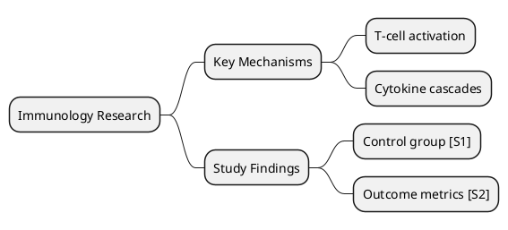

# Doom Emacs as a NotebookLM Alternative
### Source-Grounded AI Research Workspace via LiteLLM, gptel, ELISA, and the Org Ecosystem
> **Scope:** Doom Emacs (primary), LiteLLM as unified LLM gateway, gptel as the LLM client layer, ELISA for RAG, Denote for the knowledge base. No configuration code is written here — this is a workflow architecture and tool-selection reference, current to May 2026. This document is a **companion to** the *Doom Emacs as a Complete Project Management & Productivity Suite* plan; all file-layout, org conventions, and Doom module choices defined there apply here without repetition.

---

## Table of Contents

1. [NotebookLM Feature Inventory (May 2026, Non-Audio/Video)](#1-notebooklm-feature-inventory)
2. [Architecture Overview](#2-architecture-overview)
3. [LiteLLM: The Unified LLM Gateway](#3-litellm-the-unified-llm-gateway)
4. [gptel: The Emacs LLM Client](#4-gptel-the-emacs-llm-client)
5. [Source Ingestion & Multi-Format Support](#5-source-ingestion--multi-format-support)
6. [RAG Layer: ELISA + Vector Database](#6-rag-layer-elisa--vector-database)
7. [Source-Grounded Chat with Citations](#7-source-grounded-chat-with-citations)
8. [Notebook / Workspace Concept via Denote Silos](#8-notebook--workspace-concept-via-denote-silos)
9. [Custom Goals & Personas (System Prompts)](#9-custom-goals--personas-system-prompts)
10. [Saved Chat History](#10-saved-chat-history)
11. [Studio Outputs: Structured Artifacts from Sources](#11-studio-outputs-structured-artifacts-from-sources)
    - 11.1 [Briefing Document & Executive Summary](#111-briefing-document--executive-summary)
    - 11.2 [Study Guide](#112-study-guide)
    - 11.3 [FAQ Generation](#113-faq-generation)
    - 11.4 [Timeline (Chronological Summary)](#114-timeline-chronological-summary)
    - 11.5 [Mind Map](#115-mind-map)
    - 11.6 [Flashcards (Spaced Repetition)](#116-flashcards-spaced-repetition)
    - 11.7 [Data Tables (Structured Extraction → CSV/Org Table)](#117-data-tables-structured-extraction--csvorg-table)
    - 11.8 [Slide Deck (Presentation Export)](#118-slide-deck-presentation-export)
    - 11.9 [Infographics & Diagrams](#119-infographics--diagrams)
12. [Deep Research (Agentic Web Search)](#12-deep-research-agentic-web-search)
13. [Source Discovery (Curated Suggestions)](#13-source-discovery-curated-suggestions)
14. [Shared Notebook Collaboration](#14-shared-notebook-collaboration)
15. [Feature Mapping: NotebookLM → Doom Emacs Stack](#15-feature-mapping)
16. [Package & Dependency Reference](#16-package--dependency-reference)
17. [Directory Layout Integration](#17-directory-layout-integration)
18. [Workflow Reference (Daily Loop)](#18-workflow-reference-daily-loop)
19. [Known Limitations & Mitigations](#19-known-limitations--mitigations)

---

## 1. NotebookLM Feature Inventory

As of May 2026, NotebookLM's non-audio/video feature set is:

**Core RAG Engine**
- Source ingestion: PDF, Google Docs/Slides/Sheets, MS Word/DOCX, CSV, plain web URLs, YouTube transcripts, images with OCR, audio transcripts
- Retrieval-Augmented Generation with inline citations (click-to-jump to source passage)
- 1M-token context window per notebook
- Grounded responses: answers derived only from uploaded sources (no open-web hallucination)
- Discover: AI-suggested external web sources relevant to your notebook's content

**Chat Interface**
- Persistent, saved chat history per notebook
- Custom Goals & Personas: up to 5,000-character system prompt per notebook
- Deep Research: agentic, background web search producing citation-backed reports with automatic source import

**Studio Outputs (one-click generation from sources)**
- Briefing document (executive summary)
- Study guide (key concept highlights)
- FAQ (Q&A pairs extracted from sources)
- Timeline (chronological event summary)
- Mind Map (interactive concept graph)
- Flashcards (question/answer pairs with source citations)
- Data Tables (structured comparison exported to Google Sheets)
- Slide Deck (PPTX export, prompt-based per-slide editing since Feb 2026)
- Infographics (visual summary, image-gen powered)

**Excluded from this plan:** Audio Overviews (podcast), Video Overviews (Veo 3 cinematic), Lecture format (2026 roadmap item). These have no reasonable Emacs equivalent.

---

## 2. Architecture Overview

```
┌───────────────────────────────────────────────────────────────────┐
│                        DOOM EMACS SHELL                           │
│                                                                   │
│  ┌─────────────────────────────────────────────────────────────┐  │
│  │  gptel  (LLM client — chat, context, tools, MCP, streaming) │  │
│  │  gptel-got  (org-mode tooling + RAG server bridge)          │  │
│  └──────────────────────┬──────────────────────────────────────┘  │
│                         │ OpenAI-compatible API                   │
│  ┌──────────────────────▼──────────────────────────────────────┐  │
│  │  LiteLLM Proxy  (localhost:4000)                            │  │
│  │  • Routes to: OpenRouter, DeepSeek, local Ollama, etc.      │  │
│  │  • Unified /v1/chat/completions + /v1/embeddings            │  │
│  │  • Virtual keys, cost tracking, model fallback              │  │
│  └──────────────────────┬──────────────────────────────────────┘  │
│                         │                                         │
│        ┌────────────────┼────────────────┐                        │
│        ▼                ▼                ▼                        │
│  ┌──────────┐    ┌───────────┐    ┌────────────┐                 │
│  │ Cloud    │    │  Ollama   │    │  Embedding │                 │
│  │ Models   │    │  (local)  │    │  Models    │                 │
│  │OpenRouter│    │qwen3,llama│    │nomic-embed │                 │
│  │DeepSeek  │    │deepseek-r1│    │bge-m3      │                 │
│  └──────────┘    └───────────┘    └─────┬──────┘                 │
│                                         │                         │
│  ┌──────────────────────────────────────▼──────────────────────┐  │
│  │  ELISA  (RAG engine — SQLite-VSS or Qdrant vector store)    │  │
│  │  • Indexes Denote notes, PDFs, org files, web pages         │  │
│  │  • Semantic similarity retrieval at query time              │  │
│  │  • Apache Tika for PDF/DOCX parsing                         │  │
│  └──────────────────────┬──────────────────────────────────────┘  │
│                         │                                         │
│  ┌──────────────────────▼──────────────────────────────────────┐  │
│  │  Denote  (notebook/workspace layer — plain .org + .md files)│  │
│  │  Silos per project = NotebookLM "notebooks"                 │  │
│  └─────────────────────────────────────────────────────────────┘  │
│                                                                   │
│  ┌────────────┐  ┌──────────────┐  ┌────────────┐  ┌──────────┐  │
│  │ ob-plantuml│  │  org-mind-map│  │  org-drill │  │  citar   │  │
│  │ (mindmaps) │  │  / org-brain │  │  org-fc    │  │ (biblio) │  │
│  └────────────┘  └──────────────┘  └────────────┘  └──────────┘  │
└───────────────────────────────────────────────────────────────────┘
```

**Design principle:** LiteLLM is the single chokepoint for all LLM and embedding calls. gptel speaks only to `localhost:4000`; all routing, fallback, and key management is LiteLLM's job. This means switching models (e.g., from DeepSeek V4 Pro to Qwen3.6 Plus on OpenRouter) is a single line change in `litellm_config.yaml`, invisible to Emacs.

---

## 3. LiteLLM: The Unified LLM Gateway

### Role in This Stack

LiteLLM runs as a local proxy (`litellm --config litellm_config.yaml`), presenting a single OpenAI-compatible API at `http://localhost:4000`. Both gptel (chat) and ELISA (embeddings) call this endpoint. You never configure model-specific API keys or endpoints inside Emacs.

### Configuration Model (`litellm_config.yaml`)

The config defines three distinct model groups:

**Chat models** (routed by gptel):
- Primary: `deepseek/deepseek-chat` (DeepSeek V4 Pro via OpenRouter or direct API) for high-quality document Q&A
- Secondary: `openrouter/qwen/qwen3-235b-a22b` (Qwen3.6 Plus free tier on OpenRouter) for cost-free secondary queries
- Local fallback: `ollama/deepseek-r1:7b` or `ollama/qwen2.5:14b` for fully offline work

**Embedding models** (routed by ELISA for RAG indexing):
- Primary: `ollama/nomic-embed-text` — 768-dim, fast, free, fully local
- Alternative: `ollama/bge-m3` — 1024-dim, better multilingual coverage (relevant for research with non-English sources)

**Reasoning/deep-research model** (used by the gptel agentic workflow):
- `openrouter/deepseek/deepseek-r1` for multi-step reasoning tasks

### Key Features Used

LiteLLM's `/v1/chat/completions` and `/v1/embeddings` are the only two endpoints the Emacs side ever calls. LiteLLM handles:
- Model fallback chains (cloud → local Ollama if API unreachable)
- Virtual key management (single `LITELLM_MASTER_KEY` in `~/.authinfo`, no per-provider keys in Emacs config)
- Cost and token tracking (viewable at `http://localhost:4000/ui`)
- Request rate limiting to stay within OpenRouter free-tier limits

### Running LiteLLM

LiteLLM runs as a persistent background service, launched at login via a systemd user unit or a tmux session:

```
litellm --config ~/.config/litellm/config.yaml --port 4000 --drop_params
```

The `--drop_params` flag silently ignores parameters not supported by a given model, which prevents gptel's extra params from causing errors when switching models.

---

## 4. gptel: The Emacs LLM Client

### Why gptel Over Alternatives

As of May 2026, gptel is the canonical LLM client in Doom Emacs (officially integrated as `:tools llm`). It supports:
- Any OpenAI-compatible backend (including LiteLLM proxy) via `gptel-make-openai`
- Multi-modal input: text, images, documents in a single request
- Tool use / function calling for agentic workflows
- MCP (Model Context Protocol) integration via `mcp.el`
- Streaming responses into any buffer (org, markdown, plain text)
- Context management: `gptel-add` to attach buffers, regions, or files as context
- Saved chat sessions as regular `.org` or `.md` files (the basis for Section 10)

### LiteLLM Backend Registration

In `config.el`, a single backend definition covers all model switching:

```elisp
;; Reference only — no config is written in this plan
;; Register LiteLLM proxy as the sole gptel backend
(gptel-make-openai "LiteLLM"
  :host "localhost:4000"
  :protocol "http"
  :key "your-litellm-master-key"   ; read from ~/.authinfo
  :models '("deepseek-chat" "qwen3-235b" "deepseek-r1"))
(setq gptel-backend (gptel-get-backend "LiteLLM")
      gptel-model "deepseek-chat")
```

Model switching inside Emacs becomes `C-u M-x gptel-send` → choose from the transient menu.

### Doom Module

Enable in `init.el`:

```elisp
:tools
(llm +gptel)   ; Installs gptel, gptel-quick, gptel-magit
               ; Binds SPC o l, M-g in commit buffers
```

### gptel-got (org-mode Tooling Bridge)

`gptel-got` (Codeberg: `bajsicki/gptel-got`, last major update April 2026) extends gptel with tools that let the LLM autonomously browse the org directory structure, query org-ql, and read Denote notes. This is what makes the stack feel like a NotebookLM "notebook" rather than just a chat window:

- The LLM can be given a tool that reads any org headline matching an org-ql query
- Combined with ELISA's retrieval, this enables multi-hop: retrieve relevant chunks → read full note context → answer

**Security note:** gptel-got's README explicitly warns that enabling its file-traversal tools creates a privacy risk (any file in your org directory can potentially be sent to the LLM API). Use it only with models routed through your own LiteLLM proxy with a local Ollama backend, or only with cloud APIs you explicitly trust.

---

## 5. Source Ingestion & Multi-Format Support

NotebookLM accepts PDFs, DOCX, Google Docs, CSV, URLs, images with OCR. The Emacs stack replicates this via a small ingestion pipeline that converts everything into indexed plain text in the Denote silo.

### Format Coverage

| NotebookLM Source Type | Emacs Equivalent | Tool |
|---|---|---|
| PDF | Extract to plain text / org | Apache Tika (via Docker) or `pdftotext` |
| MS Word / DOCX | Extract to plain text | `pandoc --to=org` or Apache Tika |
| Google Docs / Slides | Export as DOCX or HTML first | Manual export + pandoc |
| Google Sheets / CSV | Import as org-table or keep as CSV | `org-table-import` |
| Web URL | Fetch and archive | `eww`, `wget`, or `monolith` |
| Images with OCR | OCR to text | Tesseract OCR |
| YouTube transcript | Download as text | `yt-dlp --write-auto-subs --skip-download` |
| Plain text / Markdown | Already indexable | Direct ELISA indexing |

### Ingestion Workflow

The workflow for adding a new source to a "notebook" (Denote silo):

1. **Drop the file** into `~/org/projects/<notebook>/sources/`
2. **Run the ingestion script** (a small Python wrapper around Tika + pandoc): it converts the file to a `.org` file in the same directory, creating a Denote note with the source as the body
3. **Re-index ELISA** for this silo: `M-x elisa-reindex-directory` pointing at the silo
4. The source is now available for both ELISA retrieval and direct `gptel-add` context attachment

### Apache Tika for PDF/DOCX

Apache Tika is the most robust multi-format parser available. Run it as a local Docker service:

```
docker run -d -p 127.0.0.1:9998:9998 apache/tika:latest-full
```

ELISA's `elisa-tika-server-url` variable points to `http://localhost:9998` to enable DOCX, PDF, and Office format parsing automatically.

---

## 6. RAG Layer: ELISA + Vector Database

### ELISA Overview

ELISA (Emacs Lisp Information System Assistant) — GNU ELPA, requires Emacs 29.2+ — is the only production-grade RAG package for Emacs as of May 2026. It provides:
- A retrieval pipeline: parse → chunk → embed → store → retrieve
- SQLite-VSS as the default vector store (zero additional infrastructure)
- Optional Qdrant backend for larger document collections
- `elisa-find-similar` and `elisa-chat` commands that retrieve relevant chunks and pass them to the LLM via ellama/llm.el

**Integration with gptel:** ELISA uses the `llm.el` library (the lower-level LLM abstraction that both ellama and gptel sit on top of). To route ELISA's embedding calls through LiteLLM, configure an `llm-openai-compatible` provider pointing to `localhost:4000/v1/embeddings` with model `nomic-embed-text`.

### Vector Database Choice

**SQLite-VSS (default):** Zero infrastructure. The VSS extension is a SQLite plugin providing approximate nearest-neighbor search. ELISA installs it automatically via `M-x elisa-download-sqlite-vss`. Best for collections under ~50k chunks (adequate for a research notebook of ~200 documents).

**Qdrant (larger collections):** Run via Docker:
```
docker run -d -p 6333:6333 -v ~/.qdrant:/qdrant/storage qdrant/qdrant
```
ELISA supports Qdrant as an alternative backend. Use this if a notebook grows to thousands of sources (e.g., a multi-year literature review corpus).

### Indexing Strategy

Create one ELISA collection per Denote silo (= per "notebook"). Name collections to match the silo directory:

- `~/org/projects/proj-alpha/sources/` → ELISA collection `proj-alpha`
- `~/org/projects/proj-beta/sources/` → ELISA collection `proj-beta`
- `~/org/resources/` → ELISA collection `global-resources`

This is the exact equivalent of NotebookLM's notebook isolation: queries against `proj-alpha` only retrieve from that notebook's sources.

### Embedding Model Selection

Use `nomic-embed-text` via Ollama as the default embedding model — it is:
- 768-dimensional (efficient storage)
- Optimized for RAG retrieval tasks
- Runs entirely locally on CPU (fast on the i9-13900K)
- Free, no API quota

For research with dense scientific literature, `bge-m3` (1024-dim, sparse+dense hybrid) provides better retrieval quality at the cost of slower indexing.

### Reranking (Optional)

ELISA supports a reranker step post-retrieval. A reranker model (e.g., `cross-encoder/ms-marco-MiniLM-L-6-v2` via Python/ONNX) re-scores retrieved chunks for relevance before sending them to the LLM. ELISA's documentation notes this significantly improves answer quality. Enable after the base setup is stable.

---

## 7. Source-Grounded Chat with Citations

This is NotebookLM's headline feature: responses cite the exact passage they came from, and clicking a citation jumps to that passage.

### How It Works in This Stack

The full retrieval-to-response flow:

1. User sends query in a gptel chat buffer associated with a Denote silo
2. A `gptel-tool` (defined in `config.el`) intercepts the pre-send hook and calls `elisa-find-similar` against the silo's ELISA collection
3. ELISA returns the top-k most relevant chunks, each tagged with its source file path and character offset
4. The tool injects these chunks into the gptel context as a "sources" block, formatted as org headings with `[[file:path::offset]]` links
5. The system prompt (see Section 9) instructs the LLM to cite chunks using their source identifiers when making claims
6. The LLM response includes inline citation markers
7. In the org chat buffer, citation markers are rendered as clickable `[[file:...]]` links; pressing RET on one opens the source file at the cited passage

### Citation Format Convention

Format the injected context chunks as:

```org
* Source Context
** [S1] [[file:~/org/projects/alpha/sources/paper1.org::450][Smith 2024, p.3]]
The methodology used in this study involved...
** [S2] [[file:~/org/projects/alpha/sources/report.org::1200][Internal Report §4.2]]
Results showed a 34% improvement...
```

The LLM system prompt instructs it to reference `[S1]`, `[S2]`, etc. in its answer. These short codes map to the full org links above, so the user can navigate directly.

### Citation Jump

In the gptel chat org buffer, org-mode's standard link following (`C-c C-o` or RET on the link) opens the source file at the cited line/offset. This is functionally equivalent to NotebookLM's click-to-source behavior.

---

## 8. Notebook / Workspace Concept via Denote Silos

NotebookLM organizes work into discrete "notebooks" — isolated source collections with their own chat history and custom goals. The Denote silo concept maps onto this directly.

### Denote Silo = NotebookLM Notebook

A Denote silo is a self-contained directory where `denote-directory` points. Each silo has:
- Its own set of `.org` source files (converted from PDFs, DOCX, URLs, etc.)
- Its own ELISA vector collection
- Its own gptel chat history file (`chat-history.org`)
- Its own system prompt / goals file (`notebook-goals.org`)

### Silo Layout

```
~/org/projects/proj-alpha/
├── sources/                    # Ingested source documents (Denote notes)
│   ├── 20260301T120000--smith-2024-methodology__source_pdf.org
│   ├── 20260310T090000--internal-report-q1__source_report.org
│   └── 20260315T140000--nature-article__source_web.org
├── chat-history.org            # gptel saved conversations (Section 10)
├── notebook-goals.org          # System prompt / custom persona (Section 9)
├── studio-outputs/             # All generated artifacts (Sections 11.x)
│   ├── briefing.org
│   ├── study-guide.org
│   ├── faq.org
│   ├── timeline.org
│   ├── mindmap.plantuml
│   ├── flashcards.org
│   ├── data-table.org
│   └── slides/
│       └── presentation.pptx
└── alpha.org                   # Main project file (tasks, Gantt, from PM plan)
```

### Switching Between Notebooks

A simple interactive Emacs command (implemented as a few lines of elisp in `config.el`) sets `denote-directory` to the selected silo's `sources/` directory and switches gptel's system prompt to that silo's `notebook-goals.org`. This is functionally equivalent to switching between notebooks in NotebookLM's UI.

---

## 9. Custom Goals & Personas (System Prompts)

NotebookLM allows a per-notebook system prompt of up to 5,000 characters. The Emacs equivalent is a per-silo `notebook-goals.org` file whose content is loaded as gptel's system prompt.

### How It Works

In `config.el`, a function reads the `* System Prompt` heading from the current silo's `notebook-goals.org` and sets it as `gptel--system-message` for that buffer session. The function is called by the silo-switching command (Section 8) and can also be invoked manually.

### Example Goals File

```org
* System Prompt
You are a rigorous research assistant analyzing a corpus of immunology papers.
Answer only from the provided source context. When you make a factual claim,
always cite the source using its [Sn] identifier. If the sources do not contain
sufficient information to answer, say so explicitly rather than speculating.
Use precise scientific terminology. Prefer structured answers with org-mode
headings when the response is multi-part.

* Persona Notes
- The primary researcher is John, a senior scientist in Bangladesh.
- Default citation format: [Author Year, §Section].
- For tables, use org-table format.
```

The `* Persona Notes` section is for human reference only; only `* System Prompt` is fed to the LLM.

---

## 10. Saved Chat History

NotebookLM saves chat history persistently per notebook, visible only to the owner. The Emacs equivalent leverages gptel's built-in chat serialization.

### gptel Chat Serialization

gptel saves and restores chat sessions as regular `.org` files. The structure of a saved chat in org format is:

```org
#+TITLE: proj-alpha — Research Chat
#+GPTEL_MODEL: deepseek-chat
#+GPTEL_BACKEND: LiteLLM

* You                         :gptel:
What does Smith 2024 say about the control group methodology?

* LiteLLM                     :gptel:
According to [S1], the control group was matched by age and BMI...
```

These files live at `~/org/projects/<silo>/chat-history.org`. Opening the file and running `M-x gptel-mode` resumes the conversation with full history.

### Multiple Sessions

For a single notebook, maintain multiple session files named by topic or date:

```
chat-history.org              # Ongoing main thread
chat-2026-03-methodology.org  # Focused topic session
chat-2026-04-results.org
```

`gptel-add` can attach earlier chat sessions as context when starting a new one, replicating NotebookLM's cross-session awareness.

### Privacy

Chat files live in `~/org/`, which is under local git control. They never leave the machine unless you explicitly push to a remote. If a chat is not pushed, the only entity that receives its content is the LLM API during the session — which routes through LiteLLM, so you can substitute a fully local Ollama model for sensitive material.

---

## 11. Studio Outputs: Structured Artifacts from Sources

NotebookLM's Studio panel generates structured outputs (briefings, guides, FAQs, mind maps, etc.) from the notebook's sources with a single click. The Emacs equivalent is a set of org-capture templates and gptel prompt templates that each call the same retrieval→generation pipeline but with different output-shaping system prompts.

All Studio output commands follow the same pattern:
1. `elisa-find-similar` with a broad topic query → retrieve top-20 chunks from the silo
2. Compose a generation prompt: retrieved chunks + output-specific system prompt
3. `gptel-request` (async) → stream response into a dedicated output file in `studio-outputs/`

A single interactive dispatcher command (`SPC n A` by convention) presents a completing-read menu of all Studio output types.

### 11.1 Briefing Document & Executive Summary

Equivalent to NotebookLM's "Briefing document" Studio output.

The generation prompt instructs the LLM to produce a structured executive summary of the notebook's sources, organized as: key findings, main themes, significant data points, open questions. Output format is org-mode with `** Heading` structure, citations inline.

Saved to `studio-outputs/briefing.org`. Can be exported to PDF (`C-c C-e l p`) or DOCX (`ox-pandoc`) for sharing.

### 11.2 Study Guide

Equivalent to NotebookLM's "Study guide" Studio output.

The generation prompt instructs the LLM to identify the most important concepts in the source corpus, define each in 2–3 sentences, and list related concepts. Output format: org-mode with one heading per concept, definition under each, and `#+BEGIN_QUOTE` blocks for key passages with citations.

Saved to `studio-outputs/study-guide.org`.

### 11.3 FAQ Generation

Equivalent to NotebookLM's "FAQ" Studio output.

The generation prompt asks the LLM to generate 10–20 question/answer pairs covering the most frequently asked or important questions that the source corpus can answer. Format: org-mode `** Q: …` / `*** A: …` structure with citations.

The FAQ file doubles as a quick reference for the notebook's content and can be converted to flashcards (Section 11.6) with a second pass.

### 11.4 Timeline (Chronological Summary)

Equivalent to NotebookLM's "Timeline" Studio output.

The generation prompt instructs the LLM to extract all datable events from the source corpus and order them chronologically. Output format: an org-mode list of the form:

```org
- <2020-03-15> Event description [S3]
- <2021-06> Development description [S1, S5]
```

This org timestamp format integrates directly with org-agenda: the timeline can be opened in an agenda view showing dates as a calendar.

For visual presentation, a secondary step converts this list to a Mermaid `timeline` diagram block (already covered in the PM plan's diagramming layer), rendered inline or exported as SVG.

### 11.5 Mind Map

Equivalent to NotebookLM's "Mind Map" Studio output (an interactive concept graph).

**Two approaches depending on use case:**

**PlantUML `@startmindmap`** (best for quick generation):
The LLM generates a PlantUML mindmap block based on the source themes. The block is embedded in a `.plantuml` file in `studio-outputs/` and rendered by `ob-plantuml` → PNG or SVG. The result is a static image viewable inside Emacs via `image-mode`.



**org-brain** (interactive, navigable concept map):
For a persistent, navigable concept map, org-brain creates a wiki-like network where each Denote source note is an entry. The LLM can suggest links between concepts; you accept or reject them. `M-x org-brain-visualize` shows a TUI concept map for the current entry with its parents, children, and related nodes — the closest Emacs has to NotebookLM's clickable interactive mind map.

### 11.6 Flashcards (Spaced Repetition)

Equivalent to NotebookLM's "Flashcards" Studio output.

**Generation:** The LLM generates question/answer pairs in `org-drill` or `org-fc` format, with each card tagged with the source citation.

**org-fc** (preferred for Doom Emacs):
`org-fc` (MELPA, `leonrische/org-fc`) is a modern spaced repetition system using org headlines. Each card is a heading in `studio-outputs/flashcards.org`:

```org
* What was the primary finding of Smith 2024? :fc:
:PROPERTIES:
:FC_TYPE: normal
:ID: abc123
:END:
** Front
Primary finding of Smith 2024 re: control group methodology?
** Back
The control group was matched by age and BMI [S1]. The matching
reduced confounding by ~30% compared to prior studies.
```

**org-drill** is the alternative if you prefer the SM2 algorithm (same as Anki) or have existing org-drill decks.

**anki-editor** bridge: For portable review on mobile, `anki-editor` (MELPA) exports org-fc/org-drill cards to Anki via the AnkiConnect plugin, enabling phone-based review that syncs back.

The Study Guide (Section 11.2) can be automatically converted to flashcards by running a second LLM pass over the study guide file with a "convert each concept to a flashcard" system prompt.

### 11.7 Data Tables (Structured Extraction → CSV/Org Table)

Equivalent to NotebookLM's "Data Tables" Studio output (December 2025, exports to Google Sheets).

The generation prompt asks the LLM to extract structured data from the source corpus into a specified column schema. Example:

> "Generate a table with columns: author | year | sample_size | key_finding | effect_size | p_value. Extract one row per study in the corpus."

Output format: org-table, which is directly editable in Emacs and convertible to CSV via `org-table-export`. From CSV, import into a spreadsheet with `ox-xlsx` (from the PM plan's xlsx integration) or any other tool.

The critical advantage over NotebookLM's Google Sheets export: the org-table stays in version control, can be queried with `org-ql`, and can be used as input data for gnuplot charts (already available from the PM plan's diagramming layer).

### 11.8 Slide Deck (Presentation Export)

Equivalent to NotebookLM's Slide Deck Studio output (November 2025) with PPTX export (February 2026).

The generation prompt asks the LLM to outline a presentation from the source corpus: title slide, executive summary slide, one slide per key theme, findings slide, conclusions/open questions slide. Output is an org-mode outline:

```org
* Slide 1: Title
Project Alpha — Q1 Findings Review
* Slide 2: Executive Summary
...
* Slide 3: Methodology [S1, S3]
...
```

This org outline is then passed to the PPTX skill (from the PM plan's export pipeline) to generate an actual `.pptx` file in `studio-outputs/slides/`. Per-slide editing is done by modifying the org outline and regenerating.

For an LLM-assisted per-slide refinement loop (replicating NotebookLM's Feb 2026 "fix slide 3" feature), a gptel prompt template targets a specific `* Slide N:` heading in the org outline with an inline instruction.

### 11.9 Infographics & Diagrams

Equivalent to NotebookLM's "Infographics" Studio output.

NotebookLM's infographics use an image generation model (Nano Banana Pro) to produce visual summaries. The Emacs equivalent uses diagramming tools rather than generative images, which is more appropriate for research and scientific workflows anyway:

- **PlantUML WBS** (work breakdown / hierarchical concept map)
- **Graphviz DOT** (dependency or relationship graph between concepts or entities in the source corpus)
- **Gnuplot** (data visualization from extracted tables — Section 11.7 feeds directly into this)
- **Mermaid flowchart or sequence diagram** for process descriptions

The LLM generates the diagram source code (PlantUML/DOT/Gnuplot/Mermaid syntax), which is embedded in `studio-outputs/infographics.org` as an org-babel source block and rendered by `ob-plantuml`/`ob-dot`/`ob-gnuplot`/`ob-mermaid` via `C-c C-c`.

This approach produces diagrams that are text-editable, version-controlled, and exactly reproducible — superior to NotebookLM's image-generation approach for research artifacts.

---

## 12. Deep Research (Agentic Web Search)

NotebookLM's Deep Research (November 2025) runs a background agentic web search, compiles a citation-backed report, and imports the sources into the notebook automatically. This is the most complex feature to replicate.

### Architecture

The Emacs equivalent uses gptel's tool-use / MCP capabilities with a searxng or DuckDuckGo web search tool:

1. User invokes `M-x notebook-deep-research` with a topic query
2. A gptel tool-use loop runs: the LLM generates a search plan (list of sub-queries), each sub-query is executed against the search engine, top results are fetched and cleaned
3. The LLM synthesizes a report from the retrieved content, with inline citations
4. Sources (URLs) are automatically archived to `sources/` as Denote notes and added to ELISA's index

### Search Backend

**SearXNG (recommended):** A self-hosted meta-search engine, trivially run via Docker:
```
docker run -d -p 8888:8080 searxng/searxng
```
ELISA uses SearXNG by default if configured. Override to use DuckDuckGo if Docker is not available.

### Agentic Loop via gptel Tools

The deep research agentic loop is implemented using gptel's `gptel-make-tool` API (available since gptel 0.9.8+). Define tools for:
- `web_search(query)` → calls SearXNG, returns list of results
- `fetch_page(url)` → fetches and extracts text from a URL
- `save_source(url, title, content)` → saves as Denote note + indexes in ELISA

The LLM autonomously chains these tools until it has gathered sufficient material, then produces the final report.

### Fast vs. Deep Research

Mirroring NotebookLM's distinction:
- **Fast Research:** A single `elisa-find-similar` call against the existing silo index (no web search) — instant, grounded in already-ingested sources
- **Deep Research:** The full agentic web search loop — runs asynchronously, takes 2–10 minutes, produces a new report document and expands the silo's source base

---

## 13. Source Discovery (Curated Suggestions)

NotebookLM's "Discover" feature suggests up to ~10 relevant external web sources based on the notebook's existing content. This is a lighter version of Deep Research (recommendation without agentic elaboration).

### Emacs Equivalent

A gptel prompt template that:
1. Summarizes the current silo's sources (via ELISA retrieval of top themes)
2. Sends the summary to the LLM with the prompt: "Suggest 10 specific URLs or publication titles highly relevant to this research. For each, give a 1-sentence rationale."
3. The LLM returns a list of suggestions in org format

The user reviews the list, clicks links to open them in `eww`, and invokes the ingestion pipeline (Section 5) for any they want to add.

This is necessarily less automated than NotebookLM (which has direct Google Search API access), but it works entirely offline for the LLM reasoning step.

---

## 14. Shared Notebook Collaboration

NotebookLM supports shared notebooks where multiple users can add sources, and each user has a private chat history. The Emacs equivalent:

- **Shared sources:** The `sources/` directory is a Git repository. Collaborators push new source notes via `magit`; others pull and re-run `elisa-reindex-directory`. This gives async multi-user source management.
- **Private chat history:** Each collaborator keeps their `chat-history.org` files in a `.gitignore`d personal directory, never committed to the shared repo.
- **Shared artifacts:** Studio outputs in `studio-outputs/` are committed and shared; they are the deliverables.

This is fundamentally asynchronous (no real-time co-editing), which matches the actual use pattern for most research notebooks.

---

## 15. Feature Mapping

### NotebookLM → Doom Emacs Stack

| NotebookLM Feature | Emacs Equivalent | Package/Tool |
|---|---|---|
| Source ingestion (PDF) | Apache Tika → Denote note | `tika` (Docker) + `elisa` |
| Source ingestion (DOCX) | pandoc → org | `pandoc` |
| Source ingestion (URL) | `eww`/`wget` + monolith → note | `eww`, `monolith` |
| Source ingestion (CSV) | org-table-import | org-mode built-in |
| Source ingestion (Image/OCR) | Tesseract → plain text note | `tesseract` |
| RAG with citations | ELISA retrieval + gptel | `elisa` + `gptel` |
| Click-to-source citations | org `[[file:path::offset]]` links | org-mode built-in |
| 1M-token context window | Per-silo ELISA collection; large-context model | ELISA + LiteLLM model routing |
| Notebook isolation | Denote silo per project | `denote` |
| Custom Goals / Personas | Per-silo `notebook-goals.org` → gptel system prompt | `gptel` |
| Saved chat history | gptel chat org files | `gptel` built-in |
| Briefing document | gptel generation prompt → `briefing.org` | `gptel` + ELISA |
| Study guide | gptel generation prompt → `study-guide.org` | `gptel` + ELISA |
| FAQ | gptel generation prompt → `faq.org` | `gptel` + ELISA |
| Timeline | gptel extraction → org timestamps + Mermaid | `gptel` + `ob-mermaid` |
| Mind map (static) | PlantUML `@startmindmap` via ob-plantuml | `ob-plantuml` |
| Mind map (interactive) | org-brain concept map | `org-brain` |
| Flashcards | org-fc or org-drill | `org-fc` (MELPA) |
| Anki export (mobile review) | anki-editor + AnkiConnect | `anki-editor` |
| Data Tables → spreadsheet | gptel extraction → org-table → CSV/XLSX | `gptel` + `ox-xlsx` |
| Slide Deck | gptel outline → PPTX skill | `gptel` + PPTX skill |
| Infographics | PlantUML / DOT / Gnuplot diagram | `ob-plantuml` / `ob-dot` / `ob-gnuplot` |
| Deep Research (agentic) | gptel tool-use loop + SearXNG | `gptel` tools + SearXNG |
| Source Discovery | gptel suggestion prompt | `gptel` + ELISA |
| Shared notebooks | Git-versioned sources/ + private chat gitignore | `magit` |
| Gemini app integration | — not applicable (no Google ecosystem dependency) | — |
| PPTX export | PPTX skill | See PM plan |
| Google Sheets export | org-table → CSV → XLSX | `ox-xlsx` (PM plan) |

---

## 16. Package & Dependency Reference

### New Emacs Packages (add to `packages.el` alongside PM plan packages)

| Package | Source | Purpose |
|---|---|---|
| `gptel` | NonGNU ELPA / MELPA | LLM client (or use Doom `:tools llm`) |
| `elisa` | GNU ELPA (MELPA mirror) | RAG engine with SQLite-VSS |
| `gptel-got` | Codeberg (straight.el recipe) | Org-mode tooling bridge for gptel |
| `org-brain` | MELPA | Interactive concept mapping |
| `org-mind-map` | MELPA | Graphviz mindmap from org headings |
| `org-fc` | MELPA | Spaced repetition flashcard system |
| `anki-editor` | MELPA | Anki card creation + sync from org |
| `mcp` (`mcp.el`) | GitHub (straight.el) | MCP protocol for gptel tool use |

### New System Dependencies

| Tool | Install (Fedora) | Purpose |
|---|---|---|
| `litellm` | `pip install litellm[proxy] --break-system-packages` | LLM gateway |
| `ollama` | From ollama.com | Local LLM + embedding inference |
| `nomic-embed-text` model | `ollama pull nomic-embed-text` | Default embedding model |
| `sqlite-vss` | `M-x elisa-download-sqlite-vss` (auto) | Vector search for ELISA |
| Apache Tika | `docker pull apache/tika:latest-full` | Multi-format document parsing |
| SearXNG | `docker pull searxng/searxng` | Self-hosted web search for Deep Research |
| Qdrant (optional) | `docker pull qdrant/qdrant` | Production vector DB for large corpora |
| Tesseract OCR | `dnf install tesseract tesseract-langpack-eng` | Image OCR for source ingestion |
| `monolith` | `cargo install monolith` | Full-page web archiving (offline source) |
| `pandoc` | `dnf install pandoc` | DOCX → org conversion |
| `yt-dlp` | `pip install yt-dlp` | YouTube transcript extraction |

### Packages Inherited from PM Plan (unchanged)

`denote`, `ob-plantuml`, `ob-mermaid`, `ob-dot`, `ob-gnuplot`, `mermaid-mode`, `plantuml-mode`, `org-ql`, `magit` — all continue to serve their PM-plan roles and are reused here without modification.

---

## 17. Directory Layout Integration

This plan extends the PM plan's `~/org/` layout. New additions are **bolded**:

```
~/org/
├── inbox.org
├── projects/
│   ├── proj-alpha/
│   │   ├── alpha.org               # Tasks, Gantt, clocks (PM plan)
│   │   ├── alpha-diags.org         # Diagrams (PM plan)
│   │   ├── notes/                  # Denote silo (PM plan)
│   │   ├── sources/                # ← NEW: ingested source documents
│   │   │   ├── 20260301T120000--smith-2024__source_pdf.org
│   │   │   └── 20260310T090000--report-q1__source_web.org
│   │   ├── chat-history.org        # ← NEW: gptel saved sessions
│   │   ├── notebook-goals.org      # ← NEW: per-notebook system prompt
│   │   └── studio-outputs/         # ← NEW: all generated artifacts
│   │       ├── briefing.org
│   │       ├── study-guide.org
│   │       ├── faq.org
│   │       ├── timeline.org
│   │       ├── mindmap.plantuml
│   │       ├── flashcards.org
│   │       ├── data-table.org
│   │       └── slides/
│   └── proj-beta/
├── areas/
├── resources/
│   ├── references.bib
│   ├── glossary.org
│   └── sources/                    # ← NEW: global reference material
└── daily/
```

### Git Strategy Addition

```bash
# In ~/org/.gitignore, add:
chat-history*.org        # Private chat sessions
*.elisa.db               # ELISA vector database (regeneratable)
sources/*.pdf            # Original PDFs (large binaries)
# Commit:
#   sources/*.org        (converted text — small, versioned)
#   studio-outputs/      (generated artifacts — deliverables)
#   notebook-goals.org   (system prompts — configuration)
```

---

## 18. Workflow Reference (Daily Loop)

Building on the PM plan's daily loop, the NotebookLM workflow additions are:

```
Adding a new source to a notebook:
  Drop file → ~/org/projects/alpha/sources/
  M-x notebook-ingest-file            → Tika → Denote note
  M-x elisa-reindex-directory         → update vector index

Grounded Q&A session:
  SPC o l (or M-x gptel)              → open gptel buffer
  M-x notebook-switch "proj-alpha"    → set silo + load goals
  Type query → C-c C-c                → ELISA retrieval → LLM → cited answer
  C-c C-o on [S1] citation            → jump to source passage

Studio output generation:
  M-x notebook-studio                 → completing-read output type
  "briefing" / "study-guide" / "faq"  → async generation → studio-outputs/

Flashcard review:
  M-x org-fc-review                   → spaced repetition session
  (generated cards from Section 11.6)

Deep research:
  M-x notebook-deep-research          → enter topic → background agent
  (return in 5–10 min)                → new report in studio-outputs/
  M-x elisa-reindex-directory         → new sources added to index

Mind map navigation:
  M-x org-brain-visualize             → interactive concept map for silo
  or C-c C-c on @startmindmap block   → static PlantUML render → PNG

Weekly notebook maintenance:
  M-x elisa-reindex-directory         → re-index any new sources
  Review studio-outputs/briefing.org  → update for new sources added
  M-x org-fc-stats                    → check flashcard review schedule
```

---

## 19. Known Limitations & Mitigations

| Limitation | Impact | Mitigation |
|---|---|---|
| ELISA uses SQLite-VSS, not a dedicated vector DB | Slower for very large corpora (>50k chunks) | Switch to Qdrant backend; keep silos focused |
| No visual interactive mind map (only TUI org-brain or static PNG) | Less fluid than NotebookLM's interactive graph | Use org-brain for navigation; PlantUML for shareable renders |
| Deep Research agent quality depends on model | Weaker than NotebookLM's Gemini 3-backed agent | Use deepseek-r1 (reasoning model) via LiteLLM for best results |
| No image generation for infographics | Cannot produce pixel-art visual summaries | Use diagramming tools (DOT/PlantUML) — more reproducible anyway |
| Source ingestion is semi-manual (requires running ingest command) | NotebookLM auto-ingests on upload | Mitigate with a `inotifywait`-based watcher shell script that auto-triggers the ingestion pipeline on new file drop |
| org-brain requires manual linking for new sources | Concept map doesn't auto-populate | Run a gptel-assisted link suggestion pass periodically |
| Anki export requires Anki running locally | Two-application workflow | Schedule Anki sync sessions; or use org-fc exclusively (no Anki dependency) |
| gptel-got is experimental (Codeberg) | Possible instability | Pin to a specific commit in `packages.el`; follow changelog |
| ELISA reranker requires Python ONNX runtime | Additional dependency | Skip reranker initially; add it after base pipeline is stable |
| No native Google Workspace integration | Cannot ingest Google Docs/Sheets directly | Export from Google as DOCX/CSV first; automate with rclone if needed |
| LiteLLM proxy is a long-running process | Must be started manually or managed as a service | Configure a systemd user unit: `systemctl --user enable litellm` |

---

## Integration Checklist (Setup Order)

Follow this sequence to avoid dependency order problems:

1. Install Ollama; pull `nomic-embed-text` and primary chat model
2. Start LiteLLM proxy; verify `curl localhost:4000/health` returns OK
3. Install ELISA; run `elisa-download-sqlite-vss`; configure LiteLLM as embedding provider
4. Enable `:tools llm` in Doom `init.el`; configure gptel LiteLLM backend
5. Create first Denote silo with `sources/` subdirectory
6. Ingest two or three test documents; index with ELISA
7. Test grounded Q&A with citation injection
8. Add `gptel-got` via straight.el; enable desired tools (start with read-only org tools)
9. Install org-fc; test flashcard generation
10. Set up Apache Tika Docker container; test PDF ingestion
11. Set up SearXNG Docker container; test Deep Research agentic loop
12. Configure systemd user units for LiteLLM, Tika, and SearXNG
