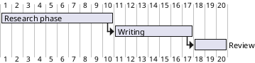
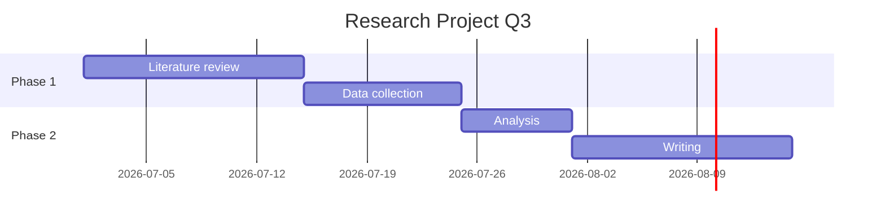
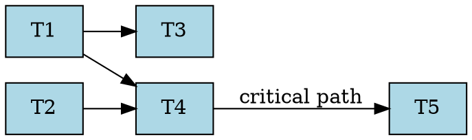

# Doom Emacs as a Complete Project Management & Productivity Suite
### Replacing OpenProject + SuperProductivity — A Comprehensive Workflow Plan
> **Scope:** Doom Emacs (primary), org-mode as the backbone, with PlantUML, Mermaid, Gnuplot, Graphviz, org-gantt, TaskJuggler, and supporting packages. No configuration code is written here — this is a workflow architecture and tool-selection reference, current to May 2026.

---

## Table of Contents

1. [Architecture Overview](#1-architecture-overview)
2. [Core Backbone: Org-mode + Doom Emacs Modules](#2-core-backbone-org-mode--doom-emacs-modules)
3. [Project & Task Management Layer](#3-project--task-management-layer)
4. [Gantt Charts & Scheduling](#4-gantt-charts--scheduling)
5. [Resource & Budget Management: TaskJuggler](#5-resource--budget-management-taskjuggler)
6. [Kanban Boards: org-kanban + elgantt](#6-kanban-boards-org-kanban--elgantt)
7. [Time Tracking & Reporting: org-clock](#7-time-tracking--reporting-org-clock)
8. [Diagramming Layer](#8-diagramming-layer)
   - 8.1 [PlantUML via ob-plantuml](#81-plantuml-via-ob-plantuml)
   - 8.2 [Mermaid via mermaid-mode + ob-mermaid](#82-mermaid-via-mermaid-mode--ob-mermaid)
   - 8.3 [Graphviz / DOT via ob-dot](#83-graphviz--dot-via-ob-dot)
   - 8.4 [Gnuplot via ob-gnuplot](#84-gnuplot-via-ob-gnuplot)
   - 8.5 [D2 & Pikchr via diagram-preview](#85-d2--pikchr-via-diagram-preview)
   - 8.6 [Ditaa (ASCII → raster)](#86-ditaa-ascii--raster)
9. [Knowledge Management: Denote (preferred over org-roam for your stack)](#9-knowledge-management-denote)
10. [Agile / Sprint Workflows](#10-agile--sprint-workflows)
11. [Reporting & Export Pipeline](#11-reporting--export-pipeline)
12. [File & Directory Conventions](#12-file--directory-conventions)
13. [Feature Mapping: OpenProject vs SuperProductivity vs This Stack](#13-feature-mapping)
14. [Tool Dependency Reference](#14-tool-dependency-reference)
15. [Known Limitations & Mitigations](#15-known-limitations--mitigations)

---

## 1. Architecture Overview

The strategy is a **layered stack** where every component feeds into org-mode files:

```
┌──────────────────────────────────────────────────────┐
│                   DOOM EMACS SHELL                   │
│                                                      │
│  ┌────────────┐  ┌───────────┐  ┌────────────────┐  │
│  │  org-mode  │  │ org-clock │  │  org-agenda    │  │
│  │ (backbone) │  │(time log) │  │  (dashboard)   │  │
│  └─────┬──────┘  └─────┬─────┘  └──────┬─────────┘  │
│        │               │               │             │
│  ┌─────▼──────────────────────────────▼─────────┐   │
│  │              org-babel (execution)            │   │
│  │  PlantUML | Mermaid | DOT | Gnuplot | TJ3    │   │
│  └──────────────────────────────────────────────┘   │
│                                                      │
│  ┌────────────┐  ┌──────────┐  ┌───────────────┐   │
│  │ org-kanban │  │elgantt   │  │ ox-taskjuggler│   │
│  │  (boards)  │  │(timeline)│  │  (scheduling) │   │
│  └────────────┘  └──────────┘  └───────────────┘   │
│                                                      │
│  ┌──────────────────────────────────────────────┐   │
│  │ Denote (knowledge base + project notes)      │   │
│  └──────────────────────────────────────────────┘   │
└──────────────────────────────────────────────────────┘
```

**Single source of truth:** plain `.org` files under a versioned directory (e.g., `~/org/`), committed to a local or remote git repo. Everything — tasks, time logs, diagrams, notes — lives there.

---

## 2. Core Backbone: Org-mode + Doom Emacs Modules

### Doom Modules to Enable

Enable these in your `init.el` (reference only — not configuration):

| Module | Purpose |
|---|---|
| `:lang org` | Core org with babel |
| `:lang org +roam2` | (optional) if you want org-roam alongside Denote |
| `:tools magit` | Git for versioning org files |
| `:ui doom-dashboard` | Quick-access launcher |
| `:editor snippets` | YASnippet templates for task/project headers |
| `:checkers syntax` | Flycheck in src blocks |
| `:tools pdf` | View exported PDFs/Gantt outputs inside Emacs |

### Org-mode Version

As of May 2026, **org-mode stable is 9.7.33** (released July 27, 2025). Doom pins org; use `(unpin! org)` in `packages.el` to get the latest.

### TODO Keyword States (Project Lifecycle)

Design a keyword sequence that maps to both a Kanban column layout and a project phase:

```
TODO NEXT IN-PROGRESS REVIEW BLOCKED DELEGATED | DONE CANCELLED
```

- `TODO` → backlog
- `NEXT` → sprint-ready
- `IN-PROGRESS` → active work (only one per context rule)
- `REVIEW` → pull-request / peer check
- `BLOCKED` → waiting on dependency
- `DELEGATED` → assigned to someone else
- `DONE` / `CANCELLED` → closed states

---

## 3. Project & Task Management Layer

### File Organization

```
~/org/
├── inbox.org            # Capture everything first
├── projects/
│   ├── proj-alpha.org   # One file per project
│   └── proj-beta.org
├── areas/               # Ongoing responsibilities (not projects)
│   ├── research.org
│   └── admin.org
├── archive/             # Completed projects
├── resources/           # Reference material
└── daily/               # Daily notes / journal (org-journal or datetree)
```

### Key Packages

**org-super-agenda** (`MELPA`) — Groups agenda views into sections. Instead of a flat list of tasks, you get named groups: "Due Today," "Blocked," "Research," "Waiting," etc. This replicates the SuperProductivity "Today" view.

**org-ql** (`MELPA`) — SQL-like querying for org tasks. Build custom saved queries like `(and (todo "IN-PROGRESS") (tags "alpha"))` to get a project-scoped active task list at any time.

**org-capture templates** — Define fast-entry templates for: new task, bug report, meeting note, daily log, expense. All route into `inbox.org` first; a weekly review sweeps them into project files.

### GTD Processing Flow

```
CAPTURE → CLARIFY (inbox.org) → ORGANIZE (refile to project)
       → REVIEW (weekly) → ENGAGE (NEXT/IN-PROGRESS)
```

Use `org-refile` with `org-refile-targets` pointing at all project files. The weekly review agenda command (`W` key by convention) shows all unprocessed inbox items.

### Priority & Effort Tagging

Use the `PROPERTIES` drawer on every actionable task:

```org
* TODO Write integration test suite
  :PROPERTIES:
  :Effort:   3h
  :PRIORITY: B
  :ALLOCATE: john
  :CONTEXT:  @coding
  :END:
```

`org-effort` integrates with `org-clock` so you can compare estimated vs actual. `CONTEXT` tags replicate SuperProductivity's "contexts/tags" feature.

---

## 4. Gantt Charts & Scheduling

You have three distinct approaches, each with different trade-offs:

### 4.1 org-gantt (pgfgantt via LaTeX → PDF)

**Package:** `org-gantt` (MELPA, multiple forks; the `SeungukShin/org-gantt` fork is most recently maintained).

**How it works:** Reads `SCHEDULED:`, `DEADLINE:`, and `:Effort:` properties from your org headlines, then generates a `\begin{ganttchart}...\end{ganttchart}` LaTeX block using the `pgfgantt` package (latest: v5.0a, June 2024). You invoke it via an org dynamic block:

```org
#+BEGIN: org-gantt-chart
:today t
:compressed nil
:header-format "year, month=name, day"
#+END:
```

`C-c C-c` on the block regenerates the LaTeX. `C-c C-e l p` exports to PDF.

**Best for:** Formal deliverable Gantt charts, publication-quality output, milestone tracking.

**Limitations:** PDF-only visibility; no interactive editing; requires a working LaTeX + pgfgantt installation.

### 4.2 elgantt (Interactive TUI Gantt calendar)

**Package:** `elgantt` (GitHub: `legalnonsense/elgantt`, not yet on MELPA; load via `straight.el` or `package!` with `:recipe`).

**How it works:** Opens an interactive buffer displaying a scrollable horizontal calendar built from your `org-agenda-files`. You can move dates by pressing keys, jump to the source heading, and customize columns via `elgantt-header-type`:

- `:date` — group by date
- `:category` — group by `CATEGORY` property
- `:hashtag` — group by `#`-prefixed tags
- `:user` — group by assigned user

Run `(elgantt-open)` to launch.

**Best for:** Day-to-day interactive scheduling, replacing the OpenProject Gantt view for personal projects.

### 4.3 Gnuplot Gantt (Data-driven, org-babel)

For data-science or research workflows where Gantt data lives in org tables, use `ob-gnuplot` to render charts inline. The workflow:

1. Maintain a task table with `| Task | Start | End | Assignee |` columns.
2. Write a `#+BEGIN_SRC gnuplot :file gantt.png` block that reads `:var data=task-table` and renders a horizontal bar chart.
3. `C-c C-c` renders and displays inline via `org-display-inline-images`.

This is the most flexible approach for computed/generated schedules and burndown overlays, but requires hand-writing the gnuplot script once.

---

## 5. Resource & Budget Management: TaskJuggler

**Package:** `ox-taskjuggler` (built into org-mode contrib; activate with `(add-to-list 'org-export-backends 'taskjuggler)`).

**External binary:** `tj3` (TaskJuggler 3.x, latest stable 3.8.4 as of July 2025). Install via gem: `gem install taskjuggler`.

### What it handles (that org-mode alone cannot)

- Automatic critical path scheduling across multiple resources
- Resource leveling (preventing over-allocation)
- Budget tracking with chargeset/account declarations
- Scenario planning (`plan` vs `reality`)
- Multi-resource HTML reports with resource allocation graphs
- Large projects: tested up to 10,000 tasks, 1,000 resources

### Org → TaskJuggler Mapping

| Org-mode element | TaskJuggler equivalent |
|---|---|
| `* Project :taskjuggler_project:` | `project` declaration |
| `SCHEDULED:` | `start` date |
| `DEADLINE:` | `end` date |
| `:Effort: 5d` | `effort 5d` |
| `:ALLOCATE: john` | `allocates john` |
| `:depends: task_id` | `depends !task_id` |
| `* Resources :taskjuggler_resource:` | `resource` declarations |
| `:complete: 70` | `complete 70` |

### Export & View Workflow

```
M-x org-export-dispatch → j → p   (export to TJ3 file)
tj3 project.tjp                    (compile; generates HTML report)
M-x eww RET /path/to/Report.html   (view inside Emacs via EWW)
```

The generated HTML contains an interactive Gantt plus a resource allocation graph — a near-complete replacement for OpenProject's project plan view.

---

## 6. Kanban Boards: org-kanban + elgantt

### org-kanban (`MELPA`: `gizmomogwai/org-kanban`)

Creates a dynamic block that renders your TODO keywords as Kanban columns. Example output:

```
| TODO | NEXT | IN-PROGRESS | REVIEW | BLOCKED | DONE |
|------+------+-------------+--------+---------+------|
| t1   | t3   | t5          | t7     |         | t9   |
| t2   | t4   | t6          |        |         | t10  |
```

Keybindings:
- `org-kanban/shift` — move a task left or right across columns
- `org-kanban/initialize-at-end` — insert the Kanban block at bottom of file
- `:mirrored t` — reverse column order (right-to-left flow)

This directly replaces SuperProductivity's Kanban-style task board.

### Custom Kanban View via org-ql + org-super-agenda

For a more powerful view, build a custom agenda command that groups tasks by TODO state in a way that mimics a Kanban board visually, using `org-super-agenda` `:group-by-todo-keyword`:

```org
(org-ql-search (org-agenda-files)
  '(and (todo) (tags "alpha"))
  :sort '(priority date)
  :super-groups '((:todo "IN-PROGRESS") (:todo "NEXT") (:todo "REVIEW")))
```

---

## 7. Time Tracking & Reporting: org-clock

This is the primary SuperProductivity replacement. `org-clock` is built into org-mode and requires no additional packages.

### Core Clock Operations

| Action | Keybinding (Doom) |
|---|---|
| Clock in to task at point | `C-c C-x C-i` |
| Clock out | `C-c C-x C-o` |
| Jump to clocked task | `C-c C-x C-j` |
| Insert clock report (clocktable) | `C-c C-x C-r` |
| Set effort estimate | `C-c C-x e` |

### Clock Persistence

Set `(setq org-clock-persist t)` so running clocks survive Emacs restarts. This is essential for research workflows where sessions are long.

### Clock Reports (clocktable)

The org clocktable is the equivalent of SuperProductivity's time report. A typical block:

```org
#+BEGIN: clocktable :scope agenda :maxlevel 4 :block thisweek
:fileskip0 t :link t :compact t :narrow 80
#+END:
```

Parameters:
- `:scope agenda` — covers all `org-agenda-files`
- `:block thisweek/thismonth/2026` — time window
- `:tags "alpha"` — filter by project tag
- `:formula %` — add a percentage column

### Effort vs Actual Analysis

Add `:effort` to the clocktable to show estimated vs actual side by side. This directly replaces SuperProductivity's "time estimation" feature.

### Advanced Visualization: org-analyzer

**Package:** `org-analyzer` (MELPA). Launches a local Java-based web server that provides an interactive visual breakdown of your `org-clock` data — heatmaps, daily summaries, per-project pie charts. Run via `M-x org-analyzer-start`.

### Burndown Charts via Gnuplot

Track sprint velocity inside an org table and render a burndown chart inline:

```org
#+NAME: burndown-data
| Day | Remaining | Ideal |
|-----+-----------+-------|
|   0 |        40 |    40 |
|   1 |        38 |    36 |
...

#+BEGIN_SRC gnuplot :var data=burndown-data :file burndown.png
set terminal png size 800,400
set title "Sprint Burndown"
set xlabel "Day"
set ylabel "Story Points"
plot data using 1:2 with linespoints title "Actual", \
     data using 1:3 with lines dashtype 2 title "Ideal"
#+END_SRC
```

---

## 8. Diagramming Layer

All diagrams live as `org-babel` source blocks in your `.org` files. The standard workflow is:
1. Write the diagram source inside a `#+BEGIN_SRC <lang>` block.
2. `C-c C-c` to execute and generate an image file (`:file diagram.png`).
3. `C-c C-x C-v` (`org-display-inline-images`) to render inline.

### 8.1 PlantUML via ob-plantuml

**Mode:** `plantuml-mode` (MELPA).  
**Backend:** `plantuml.jar` (local, requires JVM) **or** native binary if your distro packages it. Set `org-plantuml-exec-mode` to `'jar` or `'executable`.

**Use cases in project management:**
- **Sequence diagrams** — protocol interactions, API flows
- **Activity diagrams** — process/workflow modeling
- **Component diagrams** — system architecture
- **WBS diagrams** — work breakdown structure (directly relevant to OpenProject WBS view)
- **Mindmaps** — project scoping and brainstorming
- **Gantt** — PlantUML has native `@startgantt` support for simple charts (no LaTeX required)

**PlantUML Gantt example (no LaTeX needed):**



This renders as a PNG inline in org-mode — no LaTeX, no pgfgantt.

### 8.2 Mermaid via mermaid-mode + ob-mermaid

**Modes:** `mermaid-mode` (MELPA) + `ob-mermaid` (MELPA: `arnm/ob-mermaid`).  
**Backend:** `mmdc` binary from `@mermaid-js/mermaid-cli` (npm). Alternative: Docker or Kroki.

**Use cases:**
- **Gantt charts** — Mermaid has native Gantt syntax with section grouping
- **Flowcharts** — decision flows, process maps
- **Class diagrams** — data model documentation
- **State diagrams** — task state machines
- **ER diagrams** — data relationships
- **Quadrant charts** (added in Mermaid v10+) — priority/effort matrices

**Mermaid Gantt example:**



**Key difference from PlantUML Gantt:** Mermaid renders via JavaScript/browser-compatible SVG, which is better for HTML exports and web publishing. PlantUML Gantt renders to PNG/SVG via JVM.

### 8.3 Graphviz / DOT via ob-dot

**Built into org-babel** (no extra package needed — `dot` language is native).  
**Backend:** `dot` binary from `graphviz` package.

**Use cases:**
- **Dependency graphs** — task dependency visualization (replaces OpenProject dependency view)
- **Organizational charts** — team/resource structure
- **Network diagrams** — system topology
- **Decision trees** — research protocol mapping
- **Call graphs** — code architecture (if managing software projects)

**DOT org-babel example:**



`C-c C-c` produces a PNG dependency graph inline.

### 8.4 Gnuplot via ob-gnuplot

**Package:** `gnuplot` + `gnuplot-mode` (MELPA).  
**Built into org-babel** as language `gnuplot`.

**Use cases:**
- **Burndown charts** — sprint tracking
- **Velocity charts** — story points per sprint
- **Time distribution plots** — pie/bar charts from clocktable data
- **Progress over time** — completion percentage over project duration
- **Resource utilization** — hours per person per week

The key advantage: gnuplot can read directly from org tables using `:var data=table-name`, making it fully data-driven with no external CSV files.

### 8.5 D2 & Pikchr via diagram-preview

**Package:** `diagram-preview` (GitHub: `natrys/diagram-preview`). Uses the **Kroki** unified API under the hood, supporting: Graphviz, PlantUML, Mermaid, D2, Pikchr, Bytefield, Vega-Lite, and more — without requiring local toolchains for each.

> **Privacy note:** The default uses Kroki's public hosted instance. For sensitive research work, self-host Kroki with Docker: `docker run -p 8000:8000 yuzutech/kroki`.

**D2** is a modern diagram language with automatic layout — useful for architecture and system diagrams where manual layout is tedious.

**Hook into modes:**

```emacs-lisp
;; reference only — shows which modes diagram-preview hooks into
(graphviz-dot-mode plantuml-mode mermaid-mode pikchr-mode d2-mode)
```

### 8.6 Ditaa (ASCII → raster)

**Built into org-babel** (`ditaa` language). Converts ASCII box-art into PNG diagrams. Requires `ditaa.jar`.

**Use case:** Quick architecture sketches written in plain text that render into clean diagrams. Less powerful than the others but extremely fast to author.

---

## 9. Knowledge Management: Denote

Given your existing migration from org-roam/org-gtd to a **Denote-based stack**, Denote is the right choice here.

**Package:** `denote` (GNU ELPA / MELPA, by Protesilaos Stavrou — actively maintained).

### Denote vs org-roam for Project Work

| Aspect | Denote | org-roam |
|---|---|---|
| Performance | Faster (no SQLite background process) | Slower with large vaults |
| File naming | Deterministic timestamp-slug-keywords | UUID-based |
| Dependencies | Minimal (no sqlite3) | Requires sqlite3 |
| Doom integration | Works out of the box | Requires `unpin!` to avoid conflicts |
| Multi-format | `.org`, `.md`, `.txt` | Primarily `.org` |
| Backlinks | Via `xref` / grep | Via SQLite DB |
| Mobile sync | Simple (any sync tool) | Needs DB rebuild |

### Project-Linked Notes Pattern

Use Denote's **silo** feature to create a per-project knowledge base:

```
~/org/projects/alpha/
├── proj-alpha.org                    # tasks/Gantt (org-mode)
└── notes/                            # Denote silo for this project
    ├── 20260301T141500--meeting-kickoff__alpha_planning.org
    ├── 20260315T090000--architecture-decision__alpha_design.org
    └── 20260401T163000--risk-register__alpha_risks.org
```

Link from tasks in `proj-alpha.org` to specific Denote notes via org file links. This replicates OpenProject's "Documents" / "Wiki" per-project.

### Daily Notes Integration

Use `denote-journal` (built into Denote v3+) for daily standup-style logs. Each day's entry auto-links to active projects via `denote-link` or manual `org-id` links.

---

## 10. Agile / Sprint Workflows

### Sprint Definition in Org

A sprint is a dated org subtree with a specific tag set:

```org
* Sprint 12 :sprint:
  SCHEDULED: <2026-06-02> DEADLINE: <2026-06-13>
  :PROPERTIES:
  :SPRINT_ID: 12
  :VELOCITY_TARGET: 30
  :END:

** NEXT Write auth middleware              :alpha:
   :PROPERTIES: :Effort: 4h :STORY_POINTS: 3 :END:

** NEXT Set up CI pipeline                :infra:
   :PROPERTIES: :Effort: 6h :STORY_POINTS: 5 :END:
```

### Sprint Board Commands

- **Sprint backlog view:** org-agenda custom command filtered by `:sprint:` tag and current sprint date range.
- **Kanban of current sprint:** `org-kanban` block scoped to the sprint subtree.
- **Burndown:** gnuplot block reading from a `:STORY_POINTS:` table maintained by a small elisp function or manually.
- **Velocity chart:** gnuplot bar chart across sprint history — read from an org table of past sprints.

### Effort Estimation Columns

Use `org-columns` for a spreadsheet-like view of effort and story points:

```org
#+COLUMNS: %50ITEM(Task) %TODO %PRIORITY %Effort(Est){:} %CLOCKSUM(Actual) %STORY_POINTS(SP)
```

`C-c C-x C-c` opens the column view; `C-c C-c` closes it. This directly replaces OpenProject's "work package" table view.

---

## 11. Reporting & Export Pipeline

### Available Export Backends

| Export | Command | Output | Use case |
|---|---|---|---|
| HTML | `C-c C-e h h` | `.html` | Share progress with stakeholders |
| PDF (LaTeX) | `C-c C-e l p` | `.pdf` | Formal reports, Gantt PDFs |
| TaskJuggler HTML | `M-x tj3` | HTML report | Full project plan with resource graph |
| Markdown | `C-c C-e m m` | `.md` | GitHub/GitLab wiki |
| ODT | `C-c C-e o o` | `.odt` | LibreOffice-compatible deliverables |
| iCalendar | `M-x org-icalendar-combine-agenda-files` | `.ics` | Sync deadlines to external calendar |

### Automatic Progress Reports

Use `org-babel-tangle` to extract report templates and `org-clock-csv` (package on MELPA) to export time data as CSV for external analysis in R or Python if needed.

### ox-taskjuggler HTML Reports

The TaskJuggler HTML export includes:
- Traditional Gantt chart (task bars with `effort`, `effortdone`, `effortleft` columns)
- Resource allocation graph (shows over/under allocation)
- Interactive navigation between plan view and resource view

Set the HTML report width to 1000+ pixels via `org-taskjuggler-default-reports` to avoid narrow output (known issue with default settings).

---

## 12. File & Directory Conventions

```
~/org/
├── inbox.org               # GTD capture target
├── next-actions.org        # @contexts: @coding @writing @admin
├── someday.org             # Deferred/maybe items
├── projects/
│   ├── proj-alpha/
│   │   ├── alpha.org       # Tasks, Gantt, clocks
│   │   ├── alpha-diags.org # PlantUML/Mermaid/DOT diagrams
│   │   └── notes/          # Denote silo
│   └── proj-beta/
│       └── beta.org
├── areas/
│   ├── research.org
│   └── admin.org
├── resources/
│   ├── references.bib      # BibTeX (if Citar/org-cite in use)
│   └── glossary.org
├── archive/
│   └── 2025/
│       └── completed-proj.org.gpg  # Encrypted archive
└── daily/
    └── 2026/
        ├── 2026-05.org     # Monthly datetree
        └── journal/        # Denote daily notes
```

### Git Strategy

```bash
cd ~/org && git init
echo "*.gpg" >> .gitignore        # Don't commit encrypted files
echo "*.png" >> .gitignore        # Don't commit generated images
git add -A && git commit -m "init"
```

Use `magit` (`SPC g g`) for all version control operations without leaving Emacs.

---

## 13. Feature Mapping

### OpenProject → Emacs Stack

| OpenProject Feature | Emacs Equivalent | Package/Tool |
|---|---|---|
| Work packages (tasks) | org headings with TODO keywords | org-mode built-in |
| Gantt chart (view) | elgantt interactive buffer | `elgantt` |
| Gantt chart (export) | org-gantt → pgfgantt PDF | `org-gantt` + LaTeX |
| Gantt chart (simple) | PlantUML `@startgantt` or Mermaid | `ob-plantuml` / `ob-mermaid` |
| Resource allocation | TaskJuggler resource graph | `ox-taskjuggler` + `tj3` |
| Critical path | TaskJuggler automatic scheduling | `ox-taskjuggler` + `tj3` |
| Project wiki | Denote notes silo per project | `denote` |
| Work breakdown structure | PlantUML WBS diagram | `ob-plantuml` |
| Project roadmap | Mermaid timeline diagram | `ob-mermaid` |
| Team calendar | org-agenda with iCal export | org-mode built-in |
| Budget tracking | TaskJuggler `account`/`chargeset` | `ox-taskjuggler` |
| Issue tracker | org-mode + org-ql custom views | `org-ql` |
| Custom fields | org PROPERTIES drawer | org-mode built-in |
| Dependency graph | Graphviz DOT diagram | `ob-dot` |
| Milestone tracking | org-gantt milestone property | `org-gantt` |
| Progress % | `:complete:` property (TJ3) or `[%]` cookies | org-mode built-in |
| Activity log | `LOGBOOK` drawer (auto) | org-mode built-in |
| Custom reports | clocktable + gnuplot | org-mode + `ob-gnuplot` |
| Export to MS Project | TaskJuggler → tj3 → custom | `ox-taskjuggler` |

### SuperProductivity → Emacs Stack

| SuperProductivity Feature | Emacs Equivalent | Package/Tool |
|---|---|---|
| Today view | org-agenda daily view | org-mode built-in |
| Task timer (Pomodoro) | org-pomodoro | `org-pomodoro` (MELPA) |
| Time tracking | org-clock (clock in/out) | org-mode built-in |
| Time reports | clocktable `:block thisweek` | org-mode built-in |
| Kanban board | org-kanban dynamic block | `org-kanban` |
| Distraction blocker | `M-x olivetti-mode` / `writeroom-mode` | Doom `:ui zen` |
| Subtask progress bar | `[/]` or `[%]` cookies in heading | org-mode built-in |
| Tags/contexts | org tags and CONTEXT property | org-mode built-in |
| Recurring tasks | `SCHEDULED: <date .+1w>` | org-mode built-in |
| Due date tracking | `DEADLINE:` with warning days | org-mode built-in |
| Effort estimation | `:Effort:` property | org-mode built-in |
| Notes on tasks | Drawer content + Denote link | org-mode + `denote` |
| Project breakdown | Column view + org-ql | `org-ql` |
| Sync across devices | Git + Syncthing / rsync | External |
| Idle detection | `org-clock-idle` auto-resolve | org-mode built-in |

---

## 14. Tool Dependency Reference

### Emacs Packages (install via `packages.el`)

| Package | Source | Notes |
|---|---|---|
| `org-super-agenda` | MELPA | Agenda grouping |
| `org-ql` | MELPA | Org query language |
| `org-kanban` | MELPA | Kanban boards |
| `org-pomodoro` | MELPA | Pomodoro timer |
| `org-analyzer` | MELPA | Clock visualization |
| `elgantt` | GitHub (straight.el) | Interactive Gantt |
| `org-gantt` | GitHub (straight.el) | LaTeX Gantt |
| `mermaid-mode` | MELPA | Mermaid major mode |
| `ob-mermaid` | MELPA | Babel for Mermaid |
| `plantuml-mode` | MELPA | PlantUML major mode |
| `gnuplot-mode` | MELPA | Gnuplot editing + execution |
| `denote` | GNU ELPA / MELPA | Knowledge management |
| `org-clock-csv` | MELPA | CSV export of clock data |
| `diagram-preview` | GitHub | Multi-format preview via Kroki |
| `olivetti` | MELPA | Distraction-free writing |

### System Dependencies

| Tool | Install | Purpose |
|---|---|---|
| `graphviz` | `dnf install graphviz` | DOT diagrams |
| `plantuml.jar` | Download from plantuml.com | PlantUML rendering |
| `java` / `openjdk` | `dnf install java-21-openjdk` | JVM for PlantUML + org-analyzer |
| `mmdc` | `npm install -g @mermaid-js/mermaid-cli` | Mermaid CLI |
| `gnuplot` | `dnf install gnuplot` | Chart rendering |
| `taskjuggler` (`tj3`) | `gem install taskjuggler` | Project scheduling |
| `texlive-pgfgantt` | `dnf install texlive-pgfgantt` | LaTeX Gantt |
| `texlive-xetex` | `dnf install texlive-xetex` | PDF export engine |
| `ditaa` | `dnf install ditaa` | ASCII→PNG diagrams |

---

## 15. Known Limitations & Mitigations

| Limitation | Impact | Mitigation |
|---|---|---|
| No real-time multi-user collaboration | Cannot share live kanban with a team | Export to HTML/PDF for sharing; use Git for async collaboration |
| elgantt is not on MELPA | Harder installation | Use `straight.el` with recipe from GitHub |
| org-gantt requires LaTeX | Complex dependency chain | Use PlantUML `@startgantt` or Mermaid as lighter alternative |
| TaskJuggler HTML output is narrow by default | Gantt cuts off on screen | Override `org-taskjuggler-default-reports` to set `width 1000` |
| org-clock has no mobile companion | Cannot clock from phone | Use Syncthing + Orgzly (Android) or Beorg (iOS) to add clock entries; they sync back |
| No built-in Gantt editing UI | Must edit source text to move bars | elgantt supports date-moving by keyboard; or use PlantUML preview with live refresh |
| Mermaid requires Node.js/npm | Additional runtime dependency | Use Kroki self-hosted Docker instance as alternative renderer |
| org-roam SQLite can conflict with Doom pins | Package loading issues | Use Denote instead (zero-dependency), or `(unpin! org-roam)` |
| TaskJuggler Ruby gem can break | Ruby version dependency | Pin gem version; containerize with `bundler` |
| No GUI resource drag-drop | Resource allocation requires text editing | Use `org-columns` view for spreadsheet-style resource editing |

---

## Workflow Integration Summary

The full daily loop in this stack:

```
Morning:
  SPC o a a       → org-agenda: today's tasks + clock report
  C-c C-x C-i     → clock in to first NEXT task

During work:
  C-c C-x C-o     → clock out (auto-logs time)
  SPC n r n       → denote-new (capture meeting/decision note)
  C-c C-c         → execute diagram block (re-render on change)

Weekly review:
  SPC o a W       → weekly agenda: unprocessed inbox + overdue
  M-x elgantt-open → visual schedule check
  C-c C-x C-r     → insert/update clocktable for week
  C-c C-e l p     → export status report PDF

Sprint review:
  M-x org-export-dispatch → j → p  (export TJ3 → Gantt + resource graph)
  M-x org-analyzer-start            (visualize time distribution)
  C-c C-x C-c                       (column view: effort vs actual per task)
```

This stack — centered on Doom Emacs, org-mode, TaskJuggler, org-clock, and the org-babel diagramming ecosystem — covers every feature category offered by OpenProject and SuperProductivity, entirely within a single editor, with plain-text files, full git versioning, and no cloud dependency.
